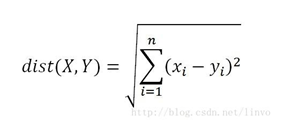
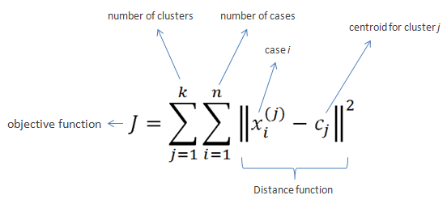
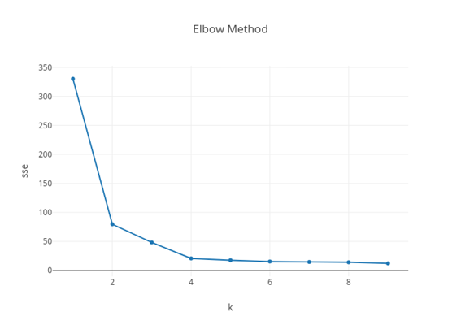
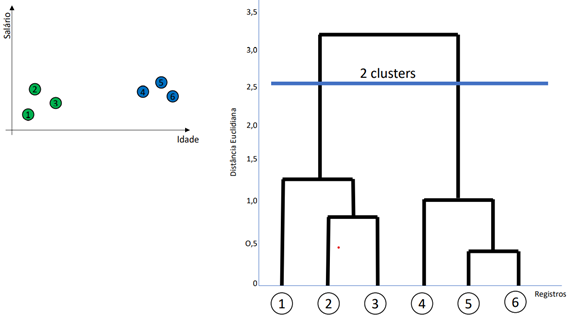
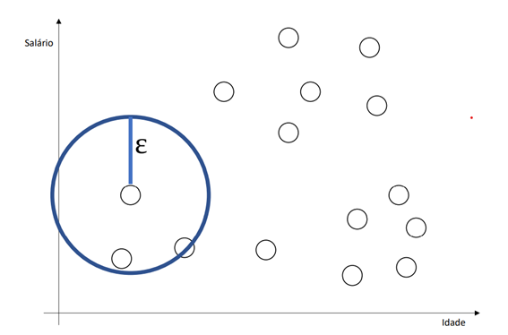

Agrupamento (clustering) 

a)	É uma técnica não supervisionada

b)	Exemplo de utilizações:
• Segmentação de mercado 
• Encontrar grupos de clientes que irão comprar um produto (mala direta) 
• Agrupamento de documentos/notícias 
• Agrupamento de produtos similares
 • Perfis de clientes (Netflix) 
• Análise de redes sociais (encontra padrões)

c)	Algoritmos que funcionam como Agrupamento:
• Cria novos dados 
• Não tem um rótulo e o algoritmo aprende as relações entre os dados 
• Identificar quando um grupo começa e outro termina 
• Elementos dentro de um grupo devem ser similares e diferentes dos que estão fora do grupo (nearest mean): Cálculo de distância (quão próximo, quão semelhante)

1.	ALGORITMO DE LOYD (KMEANS)
a)	Define os centroides aleatoriamente (centros de um cluster) 
b)	Cálculos com Kmeans: Para cada ponto na base de dados, calcular a distância para cada centroide e associar ao que estiver mais perto. Distância euclidiana (DE).

X e y são os centroides. Quando menor o valor do DE, menor é a distância entre os valores, ou seja, são mais semelhantes.
Também pode-se utilizar uma reta para visualização dos grupos.
	Calcular a média de todos os pontos ligados a cada centroide e definir um novo centroide (repetir as etapas 2 e 3)
Inicialização: Cálculos com Kmeans ++ 
É um algoritmo que evita colocar dois centroides perto um do outro, evitando uma inicialização ruim. O primeiro centroide é escolhido randomicamente, os outros são escolhidos baseados no outro ponto (longe).
Definição do número de clusters (não existe uma garantia, deve haver testes)
	Pode ser previamente definida (pelo cliente, por exemplo)
	Cálculo de cluster, pode ser pelo cálculo de n ou pelo cálculo Elbow method: 
	Cálculo de n: N=quantidade de registros 
Cluster = √(n/2)
	Elbow method: tenta vários valores de k

Utiliza a variável: WCSS (within-cluster sum of square): que calcula a distância do centroide aos valores (quanto menor, melhor).

Nota: Observa-se no gráfico de exemplo, que o melhor número de cluster (k) seria 4.  A partir desse número, não muda muito o valor de sse e quanto maior for a quantidade de cluster, maior a chance de sobrar um registro para cada cluster (o que é muito inadequado).

Exercício: 
https://colab.research.google.com/drive/15u0J0c09EUPBlJJ02g17AOWFMExbBips#scrollTo=VHX2J-Xkz_Wb)

Fonte da base de dados: 
https://archive.ics.uci.edu/ml/datasets/default+of+credit+card+clients

2.	AGRUPAMENTO HIERÁRQUICO
a)	O agrupamento hierárquico é um algoritmo que agrupa dados semelhantes em uma estrutura em forma de árvore para indicar o número de clusters.
b)	Abordagem aglomerativa: Cada registro pertence ao seu próprio cluster e os pares de clusters são unidos.
c)	Cálculo da distância euclidiana.
d)	Os resultados podem ser demonstrados em um gráfico: dendrograma.
e)	A figura abaixo (fonte: Udemy), demonstra a divisão de seis registros em 2 clusters. Calcula-se a distância entre os pontos e coloca-se uma linha de intersecção entre eles. A linha azul, deve passar pela maior linha (desde que esta linha maior não cruze com outra). A quantidade de linhas por onde a linha azul passa, define o número de clusters.

3.	AGRUPAMENTO DBSCAM (Density-Based Spatial Clustering of Applications with Noise)
A)	Baseado em densidade, agrupando os pontos similares no mesmo espaço
B)	Não é necessário especificar o número de clusters
C)	Em geral apresenta melhores resultados que o k-means 
D)	Mais rápido que o k-means 
E)	Tenta encontrar os pontos que são separados por uma distância não maior do que um limiar (threshold distance)
F)	Trabalha com raios (enxerga os registros que estão dentro do raio). Ele escolhe o ponto aleatório e verifica quais registros ficam dentro do raio (cluster).
G)	Encontra padrões não lineares
H)	É robusto contra outliers
I)	O algoritmo DBSCAN agrupa pontos que são próximos uns dos outros com base em uma medida de distância a partir do raio. Uma vez que não encontre nenhum ponto dentro da região, o processo é reiniciado
J)	O algoritmo DBSCAN deve ser utilizado para encontrar associações e estruturas em dados que são difíceis de serem encontrados manualmente, sendo assim, muito utilizado para encontrar padrões e prever tendências
K)	Exemplo de um gráfico utilizando DBSCAN: Um ponto é escolhido aleatoriamente e o algoritmo encontra os registros que estão dentro do seu raio de distância.

