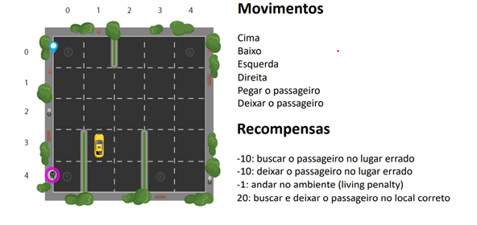
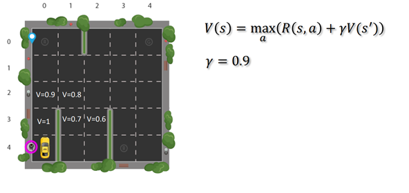
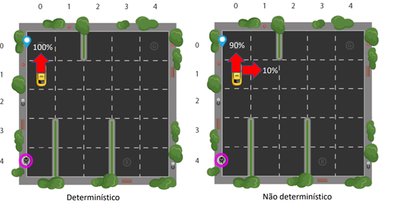
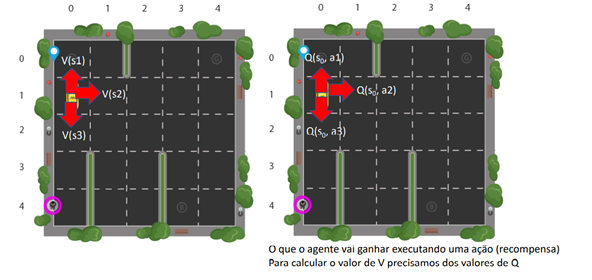
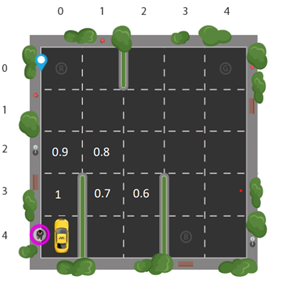

APRENDIZAGEM DE MÁQUINA: APRENDIZAGEM POR REFORÇO – ALGORITMO QLEARNING
*Ambiente gym
*Define-se o objetivo e as recompensas
*Não é necessária uma base de dados

O agente vai seguir o caminho que possui maior valor (maior recompensa).

Conceitos: EXPLORATION - o agente tem uma probabilidade alta de seguir por um caminho mas, pode explorar o ambiente se for necessário – essa abordagem é mais interessante, porque permite a aprendizagem para transpor obstáculos; EXPLOTATION - 100% de chance de seguir um caminho.

Q-Learning: Fórmula matemática para escolher as melhores ações. Quanto maior o valor de Q, melhor a solução (é uma métrica que demonstra a qualidade da ação).

Diferença temporal: Executa vários episódios. No final do treinamento, os valores devem estar armazenados, para avaliar a qualidade das ações. 

Exercício:
https://colab.research.google.com/drive/1Cwe3qKtdiKo6KVBqBBnnZJYgXSGnpeIA#scrollTo=basKM7zoqn9D
