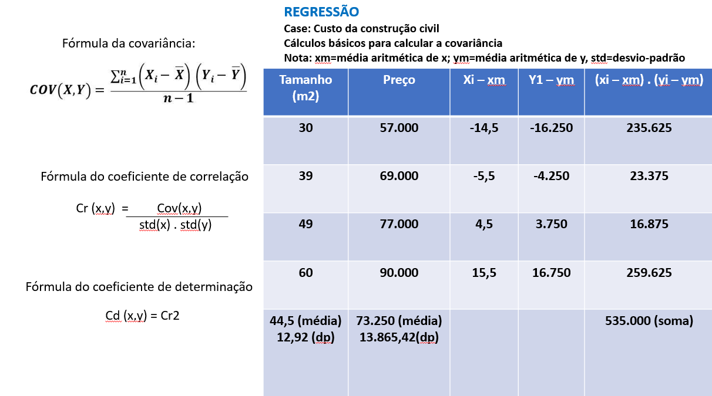
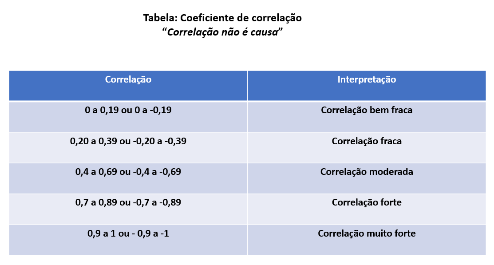
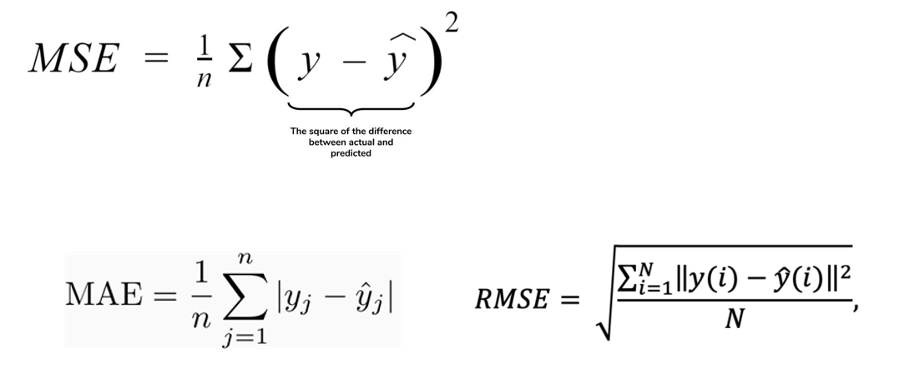

REGRESSÃO

EXercícios no colab: https://colab.research.google.com/drive/1xVNg5islR-hAllLZSFJgEJeppWRbTks0#scrollTo=yjMEdIUMvj3z

REGRESSÃO LINEAR: CÁLCULOS DE COVARIÂNCIA, COEFICIENTE DE CORRELAÇÃO E COEFICIENTE DE DETERMINAÇÃO

São cálculos utilizados para medir a relação matemática entre as variáveis.
Desvio-padrão: Quanto os valores estão afastados da média.
Na tabela em anexo constam os valores utilizados para este estudo de caso (preço do m2 na construção civil).

a) CÁLCULO DA COVARIÂNCIA (C) (Não é muito utilizado em análises, utiliza-se mais o cálculo do coefiente de correlação, principalmente porque em geral os valores estão em escalas diferentes)
C(x,y)=535.500/3=178500,00
C>0
Interpretação: 
C>0, as variáveis se movem juntas (diretamente proporcional - quanto maior a csa, maior o custo)
C<0, as variáveis se movem em direções opostas (inversamente proporcional)
C=0, as varáveis são independentes

b)CÁLCULO DO COEFICIENTE DE CORRELAÇÃO (Cr)
Divide-se a covariância pela multiplicação dos desvios-padrão de x e y
Cr=178500,00/(12,92.13865,42)=0,99

Interpretação:
* A faixa de valores de Cr é -1 e 1.
* Quando o resultado é 1 (ou próximo), indica que a variabilidade de uma variável é explicada pela outra (RELAÇÃO LINEAR).
* Neste case, a variação do preço pode ser explicada pela variação do tamanho (aumentam proporcionalmente), ou seja, elas estão relacionadas.
* Se o valor for zero, não existe correlação entre as variáveis.
* Se o resultado for negativo, as variáveis possuem uma correlação inversamente proporcional, quando uma aumenta, a outra diminui.
* Neste case, como existe a RELAÇÃO MATEMÁTICA LINEAR, pode ser aplicada a REGRESSÃO LINEAR, para observar a previsão da relação dos preços das casas com base no seu tamanho.

c) CÁLCULO DO COEFICIENTE DE DETERMINAÇÃO (Cd)
Para calcular o Cd, eleva-se o Cr ao quadrado.
Cd=099 x 0,99 = 0,98

Interpretação: 98% da variável dependente consegue ser explicada pela variável explanatória.
* No exemplo, 98% do preço consegue ser explicado pelo tamanho da casa.
* A Escala do coeficiente de determinação está entre 0 e 1, quanto mais proximo de 1, mais a variável pode ser explicada.
* No exemplo, quanto mais perto de 1, mais a variável preço consegue ser explicada pelo tamanho da casa.
* Esse coeficiente é calculado quando aplica-se a regressão linear.

REGRESSÃO LINEAR
* Objetivo - fazer previsão de números (diferente da classificação que encontra rótulos)
* Resíduo/erro: indica a distância entre a reta (previsão) e o valor(real) (distância da previsão até a linha original).
* Mede-se o erro a partir da fórmula do Mean square error (MSE):
* Fórmula MSE = (valor real-valor previsto) ao quadrado
                Somatório do erro/n
*n é o número de registros
*A ideia é ajustar os parâmetros b0 e b1 (reta prevista) para obter o menor erro.
*b0 é uma constante e b1 é o declive da reta (a linha da reta é o modelo).
*Para ajustar os parâmetros da Regressão Linear, podem ser utilizados dois algoritmos: Design matrix e Gradient descent.
*Gradient descent: Mínimo global e mínimo local

MÉTRICAS DE ERROS:
A) Mean absolute error (MAE) - Diferença entre a previsão e o valor real
B) Mean squared error (MSE) - Diferenças elevadas ao quadrado (erros penalizados)
C) Root mean squared error (RMSE) - Interpretação é facilitada (tira a raíz quadrada do MSE)

Nota: Regressão linear múltipla cada coeficiente tem o seu atributo.

REGRESSÃO LINEAR POLINOMIAL
Utilizada para problemas não linearmente separáveis (gera-se uma curva).
A diferença é que eleva x1 ao quadrado, cubo, quarta.. (exemplo:idade). É possível ter mais de um atributo.

Existem outros métodos de Regressão: ÁRVORES DE DECISÃO, RANDOM FOREST, SVM, REDES NEURAIS.

RESUMO: 
*Utiliza-se a métrica SCORE para avaliar o desempenho de um algoritmo de regressão, com o apoio do cálculo do MEAN_ABSOLUTE_ERROR, para comparar os resultados previstos com os resultados reais.
*PASSOS PARA AVALIAÇÃO DE UM ALGORITMO DE REGRESSÃO (Semelhante aos algoritmos de classificação):

1) Utilizar validação cruzada ao invés de dividir a base em porções para treinamento e teste
2)Executar pelo menos 30 testes com cada algoritmo, utilizando o valor retornado pelo score 
3) Opcionalmente calcula-se o erro: mean_absolute_error)
4) Construção de uma planilha com os resultados, calculando a média dos 30 testes de cada algoritmo
5) Aplicar os testes de Friedmann e Nemenyi para verificar se existe diferença estatística significativa entre os resultados
6) Escolher, a partir dos resultados, o melhor algoritmo

* Combinação e rejeição de classificadores:
1) Na combinação de regressores, obtem-se o valor da previsão numérica de cada algoritmo e calcula-se a média para calcular o valor final.
2) Na rejeição de regressores, estipula-se um valor mínimo para o mean_absolute_error, e caso o valor previsto seja maior que esse parâmetro, ignora-se a resposta do regressor.
